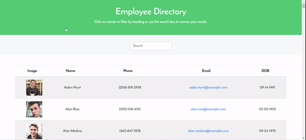

# User Directory

**URL**
https://github.com/usualketchup/UserDirectory

https://usualketchup.github.io/User-Directory/

https://drive.google.com/file/d/152suNxWWg3uu1FsIgIlOiDmq_YNR1vl3/view

## Description

* An application interface that makes it easy for a user to be able to view entire employee directory at once so that he has immediate access to their information. 

## User Story

* A user, an employee or manager would benefit greatly from being able to view non-sensitive data about other employees. It would be particularly helpful to be able to filter employees by name. The user should be able to:

  * Sort the table by at least one category

  * Filter the users by at least one property.

## Technologies Used:

    * Visual Studio Code
    * React
    * Express
    * Axios
    * CSS
    * Heroku

## Challenges:

* This activity was not too difficult because we did a number of activities in class already utilizing all of the important concepts and worked a lot of time using react and express. I started my pseudo-code to work with.  

